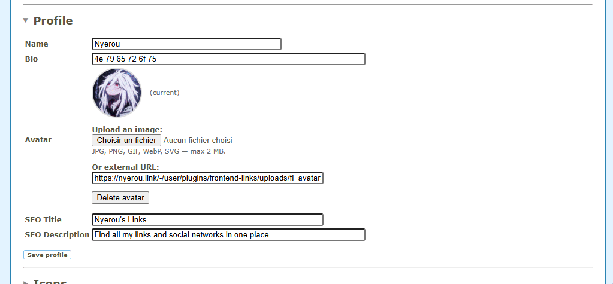
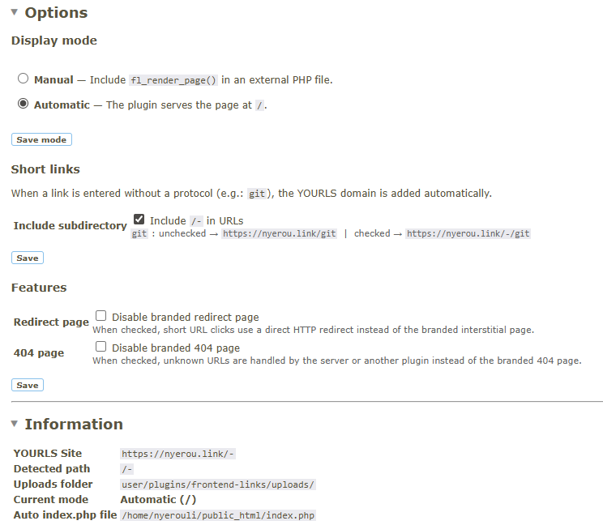
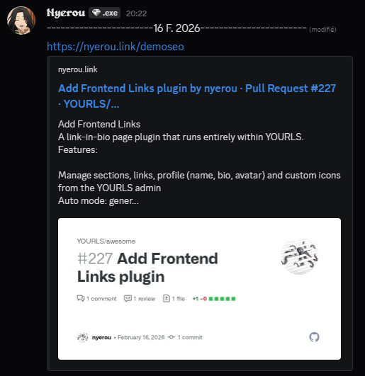

# Frontend Links - YOURLS Plugin

Link-in-bio page plugin for YOURLS — manage sections, links, profile and custom icons from the admin panel.

## Features

- **Sections & Links** management with drag-friendly sort order
- **Profile** customization (name, bio, avatar with upload/restore)
- **Custom icons** (SVG code or image upload) alongside built-in Font Awesome icons
- **Social previews**: redirect page fetches `og:image`, `og:type`, `og:description`, `theme-color` and `<title>` from the target URL for accurate social link previews (Discord, Slack, Twitter, Facebook)
- **Branded redirect page**: interstitial with target page metadata before redirecting (can be disabled)
- **Branded 404 page**: custom error page matching your site design (can be disabled)
- **Auto mode**: generates `index.php` and `.htaccess` at the document root, no manual setup needed
- **Manual mode**: include `fl_render_page()` from any PHP file
- **Subdirectory support**: works when YOURLS is installed in a subdirectory (e.g. `example.com/yourls`)
  - Short URLs resolve at the root (`/keyword` not `/yourls/keyword`)
  - Stats links (`keyword+`) are corrected to include the subdirectory
  - Auto-generated `.htaccess` handles URL rewriting
  - JSON-LD and meta tags use the root domain
- **CSP compliant**: no inline scripts or styles, compatible with YOURLS 1.10+ strict Content Security Policy
- **Security**: SVG sanitization (XSS prevention), SSRF protection on URL fetching, uploads directory lockdown
- **i18n ready** with French translation included

## Screenshots

### Sections & Links management


### Profile & Avatar


### Custom icons


### Settings & Feature toggles


### Social preview (Discord)


## Requirements

- [YOURLS](https://yourls.org/) 1.9+
- PHP 8.0+ with cURL extension
- Apache with `mod_rewrite` (for auto mode)

## Installation

1. Download or clone this repository into `user/plugins/frontend-links/`
2. Activate the plugin in the YOURLS admin (`Manage Plugins`)
3. Go to the **Frontend Administration** admin page to install tables and configure

## Configuration

### Display mode

| Mode | Description |
|------|-------------|
| **Automatic** | The plugin creates `index.php` and `.htaccess` at the document root. The link page is served at `/` and short URLs resolve at the root. |
| **Manual** | Include the rendering function in your own PHP file. |

Manual mode example:

```php
<?php
require_once __DIR__ . '/yourls/includes/load-yourls.php';
fl_render_page();
```

### Features

| Option | Description |
|--------|-------------|
| **Branded redirect page** | When enabled (default), short URL clicks show a branded interstitial with metadata fetched from the target page (title, image, description, theme color). When disabled, uses a direct HTTP 302 redirect. |
| **Branded 404 page** | When enabled (default), unknown URLs show a branded error page. When disabled, returns a basic HTTP 404. |

### Short links

When a link is entered without a protocol (e.g. `git`), the YOURLS domain is added automatically:

- `git` → `https://example.com/git`

An option allows including the YOURLS subdirectory in generated URLs if needed.

### Profile

- **Name** and **Bio** displayed on the page
- **Avatar**: upload an image or use an external URL. Previous avatar can be restored.
- **SEO Title** and **Description** for meta tags

### Custom icons

- **SVG code**: paste inline SVG, use `stroke="currentColor"` for theme adaptation (automatically sanitized)
- **Image**: upload JPG, PNG, GIF, WebP, or SVG (max 1 MB)

## File structure

```
frontend-links/
├── plugin.php              # Plugin entry point, hooks and filters
├── ajax.php                # AJAX endpoint for admin CRUD
├── includes/
│   ├── functions.php       # Core logic (CRUD, URL helpers, file management)
│   ├── icons.php           # Font Awesome + custom icon system
│   ├── install.php         # Database table creation
│   └── render.php          # Homepage rendering logic
├── templates/
│   ├── home.php            # Homepage (link-in-bio page)
│   ├── admin.php           # Admin panel interface
│   ├── redirect.php        # Branded redirect interstitial
│   └── 404.php             # Branded 404 error page
├── assets/
│   ├── css/
│   │   ├── admin.css       # Admin panel styles
│   │   ├── pages.css       # Redirect + 404 page styles
│   │   ├── my.css          # Homepage styles (compiled Tailwind)
│   │   └── all.min.css     # Font Awesome (vendor)
│   └── js/
│       ├── admin.js        # Admin panel logic (CSP-compliant)
│       ├── redirect.js     # Redirect delay script
│       ├── stats-rewrite.js # Stats link subdirectory fix
│       └── app.js          # Homepage particle system
├── uploads/                # Avatars & custom icon images (gitignored)
│   ├── .htaccess           # Security: no PHP execution, SVG headers
│   └── icons/
└── languages/              # Translation files (.pot, .po)
```

## Security

- **SVG sanitization**: all SVG input (code and file uploads) is stripped of `<script>` tags, event handlers, `javascript:` URLs, `<foreignObject>` and external `<use>` references
- **SSRF protection**: target URL metadata fetching only allows `http`/`https` schemes and blocks private/reserved IP ranges
- **Uploads lockdown**: `.htaccess` blocks PHP execution, adds `Content-Security-Policy` and `X-Content-Type-Options: nosniff` for SVG files
- **CSRF protection**: all AJAX requests verified with YOURLS nonces
- **Authentication**: admin panel and AJAX endpoint require YOURLS authentication
- **Prepared statements**: all database queries use parameterized queries (PDO)

## Changelog

### 1.2
- Admin page renamed to "Frontend Administration"
- Redirect page now fetches OG metadata from target URL (image, type, description, theme-color, title)
- Author in meta tags is now the shortener domain (e.g. `nyerou.link`)
- All CSS and JS externalized to separate asset files (CSP compliant with YOURLS 1.10+)
- New templates directory: `home.php`, `admin.php`, `redirect.php`, `404.php`
- Branded redirect interstitial page with target page metadata for social previews
- Branded 404 error page with glass-card design
- Feature toggles to disable branded redirect and/or 404 pages
- Stats links fixed to include YOURLS subdirectory when stripped by short URL filter
- Security: SVG sanitization, SSRF protection, uploads directory lockdown
- Comprehensive file header comments on all source files

### 1.1
- Subdirectory support: short URLs now resolve at the root domain
- Auto mode generates `.htaccess` with rewrite rules for short URL resolution
- JSON-LD, canonical, and Open Graph URLs use the root domain (without subdirectory)
- Link URLs displayed in admin and frontend strip the YOURLS subdirectory

### 1.0
- Initial release

## License

MIT

## Author

[Nyerou](https://nyerou.link)
