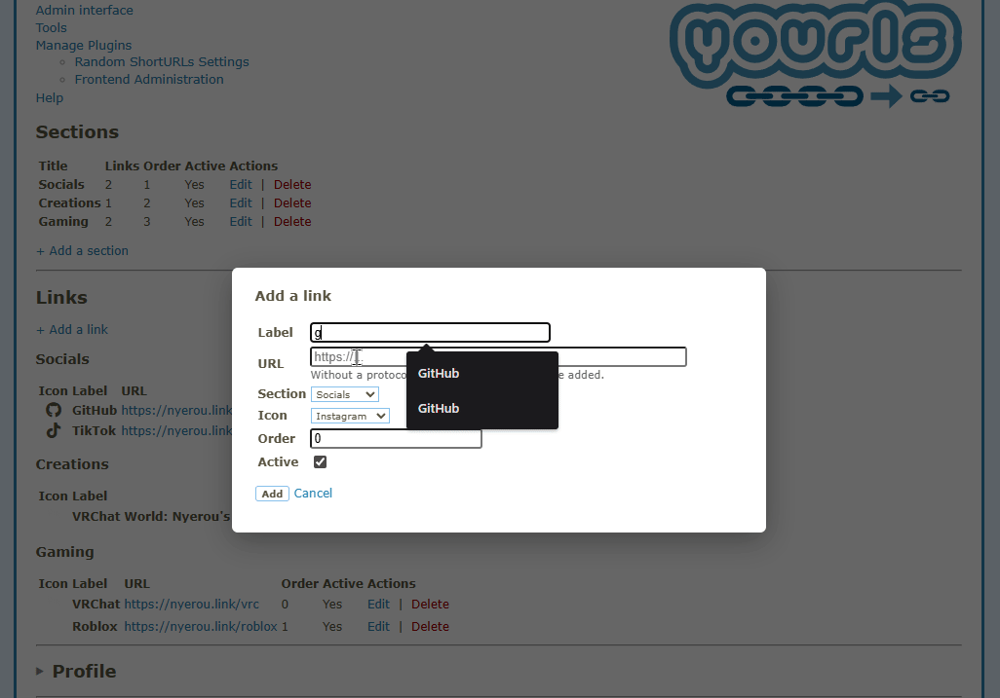

# Frontend Links [](https://github.com/YOURLS/awesome-yourls/)

Link-in-bio page plugin for YOURLS — manage sections, links, profile and custom icons from the admin panel.

## Features

- **Sections & Links** management with drag-friendly sort order
- **Profile** customization (name, bio, avatar with upload/restore)
- **Custom icons** (SVG code or image upload) alongside built-in Font Awesome icons
- **Theme system**: switchable themes from the admin; each theme has its own templates and assets
- **Default theme**: minimal responsive design with automatic light/dark mode (system preference)
- **Social previews**: redirect page fetches `og:image`, `og:type`, `og:description`, `theme-color` and `<title>` from the target URL for accurate social link previews (Discord, Slack, Twitter, Facebook)
- **Branded redirect page**: interstitial with target page metadata before redirecting (can be disabled)
- **Branded 404 page**: custom error page matching your site design (can be disabled)
- **Auto mode**: generates `index.php`, `.htaccess` and `robots.txt` at the document root, no manual setup needed
- **robots.txt generation**: auto-generated in auto mode — lists all YOURLS short URLs with destination comments, configurable `Allow`/`Disallow` per install, timestamped, auto-updates on link changes
- **Redirect rules**: optional HTTP→HTTPS and www canonical redirects injected into the generated `.htaccess`; direction auto-detected from `YOURLS_SITE`; both combined into a single 301 when active together
- **Manual mode**: include `fl_render_page()` from any PHP file
- **Subdirectory support**: works when YOURLS is installed in a subdirectory (e.g. `example.com/yourls`)
  - Short URLs resolve at the root (`/keyword` not `/yourls/keyword`)
  - Stats links (`keyword+`) are corrected to include the subdirectory
  - Auto-generated `.htaccess` handles URL rewriting
  - JSON-LD and meta tags use the root domain
- **Click tracking**: short URL clicks are correctly counted in YOURLS stats; clicks from the link-in-bio page are identified as `?ref=fl-homepage` in Traffic Sources
- **CSP compliant**: no inline scripts or styles, compatible with YOURLS 1.10+ strict Content Security Policy
- **Security**: SVG sanitization (XSS prevention), SSRF protection on URL fetching, uploads directory lockdown
- **i18n ready** with French translation included

## Demos (Screens or GIFs)

<details>
<summary>Sections & Links management</summary>

</details>

<details>
<summary>Profile & Avatar</summary>

</details>

<details>
<summary>Custom icons</summary>

</details>

<details>
<summary>Settings & Feature toggles</summary>

</details>

<details>
<summary>Social preview (Discord)</summary>

</details>

## Requirements

- [YOURLS](https://yourls.org/) 1.9+
- PHP 8.0+
- PHP extensions: `fileinfo` (avatar & icon uploads), `curl` (OG metadata fetching)
- Apache with `mod_rewrite` (for auto mode)

## Installation

1. Download or clone this repository into `user/plugins/frontend-links/`
2. Activate the plugin in the YOURLS admin (`Manage Plugins`)
3. Go to the **Frontend Administration** admin page to install tables and configure

## Configuration

### Display mode

| Mode          | Description                                                                                                                             |
| ------------- | --------------------------------------------------------------------------------------------------------------------------------------- |
| **Automatic** | The plugin creates `index.php` and `.htaccess` at the document root. The link page is served at `/` and short URLs resolve at the root. |
| **Manual**    | Include the rendering function in your own PHP file.                                                                                    |

Manual mode example:

```php
<?php
require_once __DIR__ . '/yourls/includes/load-yourls.php';
fl_render_page();
```

### Themes

Themes live in `themes/<slug>/` and contain a `theme.json` manifest, a `templates/` folder (`home.php`, `redirect.php`, `404.php`) and an `assets/` folder. The active theme is selected from **Options → Theme** in the admin panel.

The `default` theme (minimal, responsive, system light/dark mode) is active out of the box. Additional themes can be added by dropping a folder in `themes/`.

See **[docs/theming.md](docs/theming.md)** for a full guide on creating your own theme.

### robots.txt

In auto mode the plugin generates a `robots.txt` at the document root. The file lists every YOURLS short URL and is automatically re-written whenever a short URL is created, edited or deleted (file is only touched when content actually changes).

The **Short URLs indexing** option (admin → Options → robots.txt) controls the directive used for each short URL:

| Value | Directive | Effect |
|---|---|---|
| **Disallow** *(default)* | `Disallow: /keyword` | Google skips the redirect page and indexes the destination directly — saves crawl budget |
| **Allow** | `Allow: /keyword` | Googlebot crawls the branded redirect page before following to the destination |

### Redirections

Optional redirect rules injected into the generated `.htaccess` (auto mode, Apache with `mod_rewrite` only). Applied immediately when saved.

| Option | Description |
|---|---|
| **HTTP → HTTPS** | Forces all `http://` requests to `https://` (301). Skip if your server or CDN already handles this. |
| **WWW canonical** | Redirects the alternate www variant to the canonical domain. Direction is auto-detected from `YOURLS_SITE`: a non-www site redirects `www.example.com → example.com`, a www site redirects `example.com → www.example.com`. The redirect target always uses the scheme from `YOURLS_SITE`. When combined with HTTPS, both are resolved in a single 301. |

### Features

| Option                    | Description                                                                                                                                                                                               |
| ------------------------- | --------------------------------------------------------------------------------------------------------------------------------------------------------------------------------------------------------- |
| **Branded redirect page** | When enabled (default), short URL clicks show a branded interstitial with metadata fetched from the target page (title, image, description, theme color). When disabled, uses a direct HTTP 302 redirect. |
| **Branded 404 page**      | When enabled (default), unknown URLs show a branded error page. When disabled, returns a basic HTTP 404.                                                                                                  |

### Short links

When a link is entered without a protocol (e.g. `git`), the YOURLS domain is added automatically:

- `git` → `https://example.com/git`

An option allows including the YOURLS subdirectory in generated URLs if needed.

### Profile

- **Name** and **Bio** displayed on the page
- **Avatar**: upload an image or use an external URL. Previous avatar can be restored.
- **SEO Title** and **Description** for meta tags

### Custom icons

- **SVG code**: paste inline SVG, use `stroke="currentColor"` for theme adaptation (automatically sanitized)
- **Image**: upload JPG, PNG, GIF, WebP, or SVG (max 1 MB)

## File structure

```
frontend-links/
├── plugin.php              # Plugin entry point, hooks and filters
├── ajax.php                # AJAX endpoint for admin CRUD
├── migrate.php             # One-time interactive migration (fl_* options → frontend_settings)
├── includes/
│   ├── functions.php       # Core logic (CRUD, URL helpers, file management)
│   ├── icons.php           # Font Awesome + custom icon system
│   ├── install.php         # Database table creation
│   ├── render.php          # Homepage rendering logic
│   └── themes.php          # Theme resolution and discovery
├── templates/
│   └── admin.php           # Admin panel interface (not themed)
├── assets/                 # Shared assets (not themed)
│   ├── css/
│   │   ├── admin.css       # Admin panel styles
│   │   └── all.min.css     # Font Awesome (vendor)
│   └── js/
│       ├── admin.js        # Admin panel logic (CSP-compliant)
│       ├── redirect.js     # Redirect delay script
│       └── stats-rewrite.js # Stats link subdirectory fix
├── themes/
│   ├── default/            # Minimal light/dark theme (active by default)
│   │   ├── theme.json
│   │   ├── templates/
│   │   │   ├── home.php
│   │   │   ├── redirect.php
│   │   │   └── 404.php
│   │   └── assets/css/
│   │       ├── home.css
│   │       └── pages.css
│   └── <your-theme>/       # Additional themes follow the same structure
├── uploads/                # Avatars & custom icon images (gitignored)
│   └── icons/
└── languages/              # Translation files (.pot, .po)
```

## Security

- **SVG sanitization**: all SVG input (code and file uploads) is stripped of `<script>` tags, event handlers, `javascript:` URLs, `<foreignObject>` and external `<use>` references
- **SSRF protection**: target URL metadata fetching only allows `http`/`https` schemes and blocks private/reserved IP ranges
- **Uploads lockdown**: `.htaccess` auto-generated at activation — blocks PHP execution, adds `Content-Security-Policy` and `X-Content-Type-Options: nosniff` for SVG files, with the correct `RewriteBase` for root and subdirectory installs
- **CSRF protection**: all AJAX requests verified with YOURLS nonces
- **Authentication**: admin panel and AJAX endpoint require YOURLS authentication
- **Prepared statements**: all database queries use parameterized queries (PDO)

## Changelog

See [CHANGELOG.md](docs/changelog.md) for the full version history.

## License

MIT

## Author

[Nyerou](https://nyerou.link)
